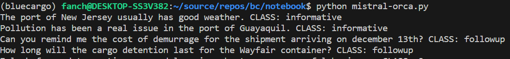
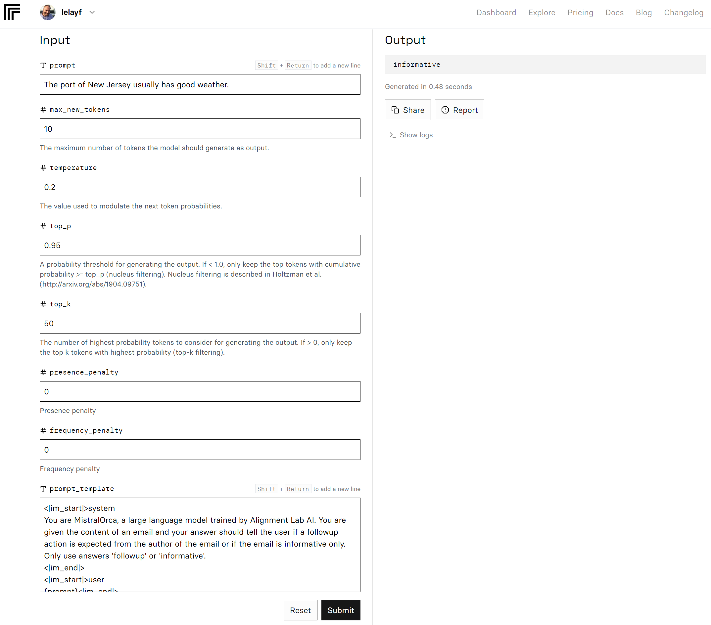
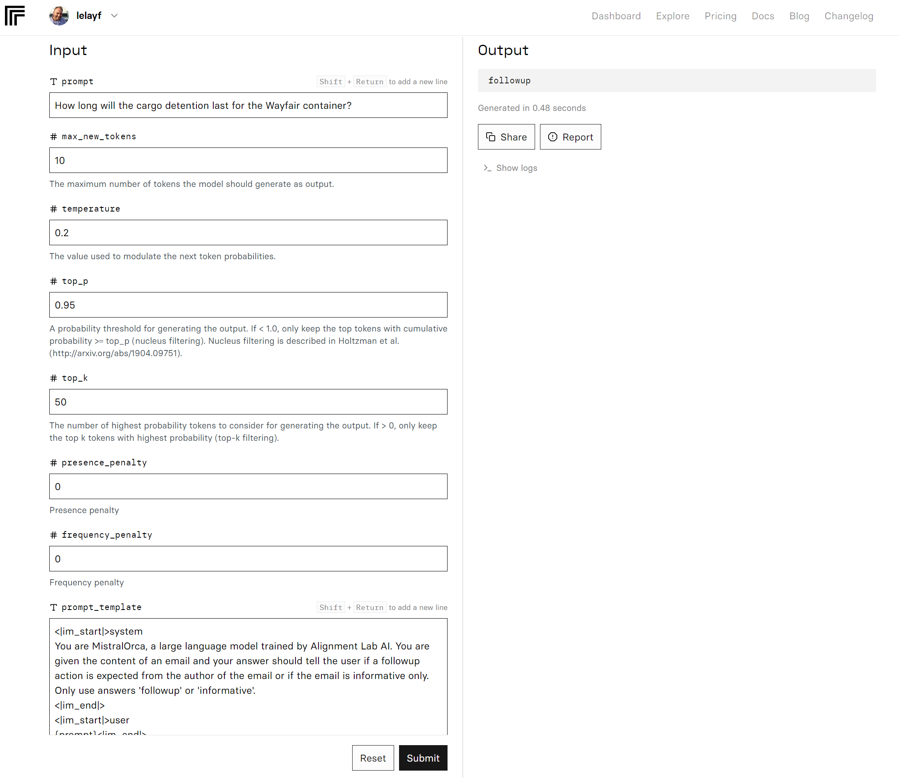
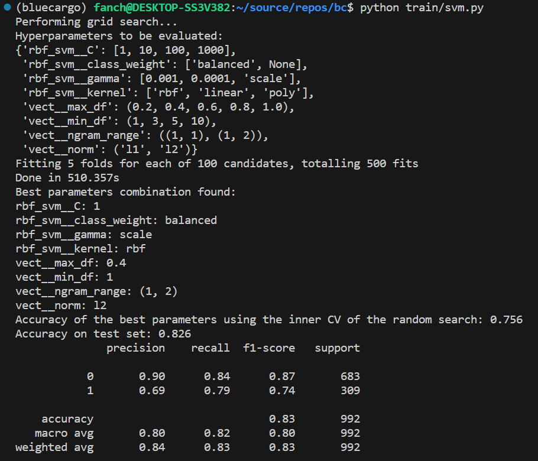
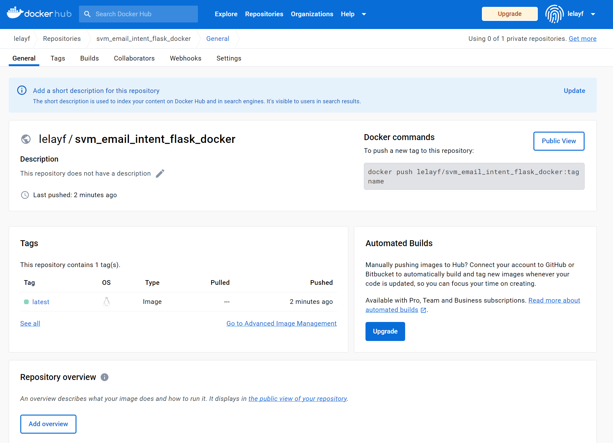
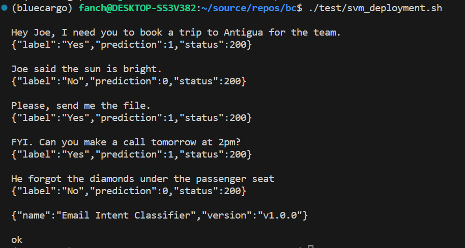

# BlueCargo Case Study

## Datasets

The data we work with is coming from the [Parakweet organization](https://github.com/ParakweetLabs/EmailIntentDataSet/wiki).
See [Modelling.ipynb](notebook/Modelling.ipynb) notebook for a brief overview of it's content.

We did not use the arff files and only use the raw text ones (designed for consumption by Weka data mining software). 

# Virtual Environment

I find that `pyenv` is really useful to manage multiple versions of Python on a single OS.
Install it and then use it to install Python 3.9.

`pyenv install 3.9`

Then proceed with the creation of a virtual environment:

`pyenv virtualenv 3.9 bluecargo`

And activate it:
`pyenv activate bluecargo`

# Python packages

Now with the virtual environment we can install the dependencies written in requirements.txt

`pip install -r requirements.txt`

# Modelling

See [Modelling.ipynb](notebook/Modelling.ipynb) notebook. 

Since we are dealing with a binary classification problem, we will focus on accuracy, precision, recall, and F1 score as our key performance metrics.

We test a number of approaches:
- Our baseline model is a variant of Naive Bayes applied to TF-IDF vectorization of the data.
- Our improved model is a Support Vector Machine 
- We also try an SGD classifier
- And an ensemble of classifiers with majority voting strategy
- an approach based on prompt engineering and the Mistral Orca 7B model, hosted on Replicate.
- an approach based on sentence embeddings produced by [all-mpnet-base-v2](https://replicate.com/replicate/all-mpnet-base-v2)

Of all those the SVM is the most accurate on the test data.

|Model|Accuracy|Precision|Recall|F1|
|-----|--------|---------|------|--|
|**Tf-IDF+SVM**|83%|80%|82%|80%|
|Tf-IDF+SGD|82%|79%|83%|80%|
|Embeddings+SVM|79%|76%|80%|77%|
|Tf-IDF+Naive Bayes|77%|80%|82%|80%|
|Embeddings+XGBoost|76%|74%|77%|74%|
|tf-IDF+Ensemble (Logistic Reg, Decision Tree, SVM)|77%|74%|77%|75%|
|Feature Hashing+SGD|74%|70%|73%|71%|
|Zero-shot (Mistral Orca 7B)|55%|64%|64%|55%|


Things to try: it could be interesting to try few-shot prompting, or different system prompts with a different taxonomy of followup actions such as "schedule shipment", "organize meeting", "provide pricing", "provide eta" (in a BlueCargo context, that is).

## Trade-offs 

Without knowing too much about the optimization criteria for an email assistant that shippers could use, it seems opportune to optimize for the recall of emails that require a follow-up action, even if it is at the expense of lesser precision. It comes down to understanding the cost of delaying follow-up actions, in the context of a business that is extremely time-sensitive (faster shipping translates in lesser warehousing costs). It seems such costs would be an order of magnitude higher than the cost of reading an email that ends up being a false positive.


## Zoom on Zero-shot classification

The system prompt we use is the following:

```
<|im_start|>system
You are MistralOrca, a large language model trained by Alignment Lab AI. You are given the content of an email and your answer should tell the user if a followup action is expected from the author of the email or if the email is informative only. Only use answers 'followup' or 'informative'.
<|im_end|>
<|im_start|>user
{prompt}<|im_end|>
<|im_start|>assistant
```

We call the API for every test email with the script `notebook/mistral-orca.py`.
Once this is done we persist the results in file `data/mistral_predictions.pq`.







## Zoom on embeddings classification

We run the scripts `notebook/embeddings_train.py` and `notebook/embeddings_test.py` to fetch embeddings of dimension 768 from the MPNet LLM hosted on Replicate. Those are then stored as parquet files, and analyzed in the `Modelling.ipynb` notebook. 

We run 2 cv-searched models:
- As before, an SVM to better assess the impact of those new features.
- an XGBoost classifier


# Productionize the SVM model 

After we have installed all the dependencies we can now run the script in train/svm.py, this script takes the input data and outputs a pipeline that includes the cross-validated search and fitting of: 
- a TF-IDF vectorizer working with both unigrams and bigrams
- an SVM classifier which corrects for training set imbalance and uses radial basis function as a kernel.

`python train/svm.py`



The resulting pipeline is persisted on disk in file `model/e2e_pipeline.dat.gz`, so that we can re-instantiate the trained model whenever the web service is spawn.


# Expose Web end point locally

Finally we can test our web application by running:

`flask run -p 5000`

# Build and publish Docker image

Now that we have our web application running, we can use the Dockerfile to create an image for running our web application inside a container

`docker build . -t svm_email_intent_flask_docker`

And now we can test our application using Docker

`docker run -p 8000:8000 svm_email_intent_flask_docker`

Finally we push our image to the official Docker hub:

`docker push svm_email_intent_flask_docker lelayf/svm_email_intent_flask_docker`

This docker image can now be used by on ECS or EKS, behind a load balancer. Ideally we would want to log the queries and predictions in an adequate system to perform ML observability.




# Testing

A few HTTP requests have been designed for testing purpose. In a terminal, simply run:

`./test/svm_deployment.sh`



# ML Observability: monitoring drift

This can be done at different stages of the model life cycle:
- by logging performance metrics after every retraining, in a tracking tool such as MLFlow
- by logging all incoming queries and predictions made
- by running periodic distributional assessments at a frequency dictated by domain expertise. this could be implemented with a data pipeline and tools such as Monte Carlo, or Arize.ai.

Typical questions to answer could be:
- "how often are we likely to see the *nature* of topics and followup actions change over time?"
- "is that topic drift seasonal or subject to a restricted set of regime switches? (analogy with financial markets)"
- "are there sudden and radical economic shocks that we should adapt to? How?"


